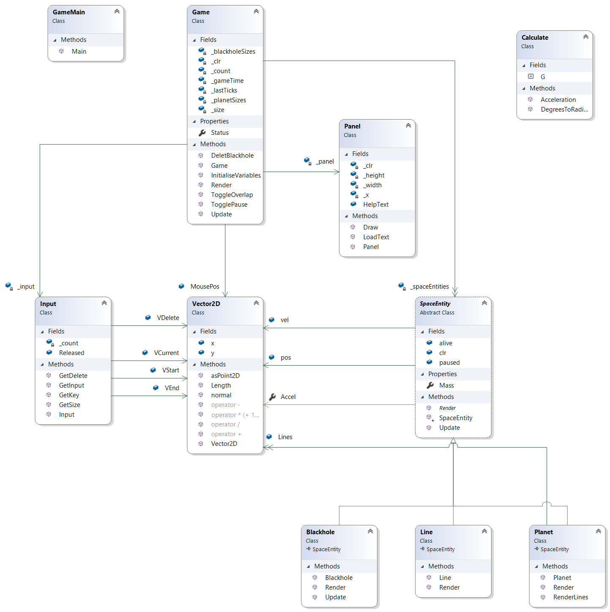

# Orbitals - Simulator

Orbitals is a gravity simulator that aims to spark creativity in the user. 
Launch planets with a your mouse, and try to get them into stable orbits around black holes to create mesmerizing  patterns.

## Getting Started

* `git clone https:https://dumiswin@bitbucket.org/dumiswin/orbitals-project.git`
* `cd orbitals-project`
* Open the csporj file
* Build and Run

### Prerequisites

.NET, dotNET frameworks

## The tests

Unit tests have been implemented and can be found in the MyGameTests folder

## Built With

* [SwinGame](http://swingame.com/) - The graphics framework
* [C#](https://docs.microsoft.com/en-us/dotnet/csharp/)

## Authors

* **Dumindu Madithiyagasthenna**

## Acknowledgments

* Swinburne DP1 staff
* Swinburne OOP staff
* SwinGame - http://swingame.com/
* Inspiration - https://play.google.com/store/apps/details?id=com.ChetanSurpur.Orbit&hl=en
* Math/Physics help - https://stackoverflow.com/questions/23877656/gravity-and-many-particles
* Research - https://en.wikipedia.org/wiki/N-body_problem

## UML

