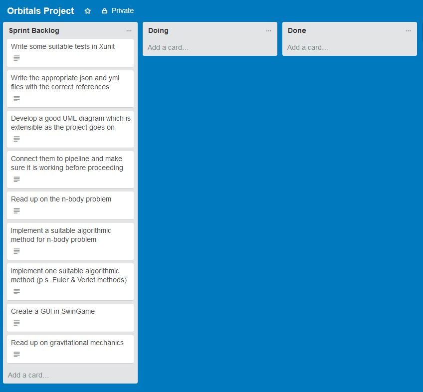

#Sprint Goal 1
	Get the gravity mechanics of the game working and implement suitable tests for it on the CI server.

#USER STORIES 
##Sprint 1 User Stories
+ As a player, I want the gravity simulations to be representative of actual phyiscal mechanics.
+ As a player, I want each planet I launch to interact with each and every other planet and blackhole thats active.
+ As a player, I want a intial graphics game up and running to visualise the physics.
+ As a developer, I want a detailed UML diagram to work with for better clarity of the project.
+ As a developer, I want to get the CI server running for smoother testing.
+ As a developer, I want to write suitable tests to comfirm that my code is up to standard and working.

##User Stories and their respective tasks with time estimates
* As a player, I want the gravity simulations to be representative of actual phyiscal mechanics
	* Read up on gravitational mechanics - 1 hour
	* Implement one suitable algorithmic method (p.s. Euler & Verlet methods) - 3 hours
* As a player, I want each planet I launch to interact with each and every other planet and blackhole thats active.
	* Read up on the n-body problem - 1 hour
	* Implement a suitable algorithmic  method - 2 hours
+ As a player, I want a intial graphics game up and running to visualise the physics.
	* Create a GUI in SwinGame - 1.5 hours
* As a developer, I want a detailed UML diagram to work with for better clarity of the project.
	* Develop a good UML diagram which is extensible as the project goes on - 2.5 hours
* As a developer, I want to get the CI server running for smoother testing.
	* Write the appropriate json and yml files with the correct references - 1 hour
	* Connect them to pipeline and make sure it is working before proceeding - 1 hour
* As a developer, I want to write suitable tests to comfirm that my code is up to standard and working.
	* Write some suitable tests in Xunit - 3 hours

##Trello Screenshot
