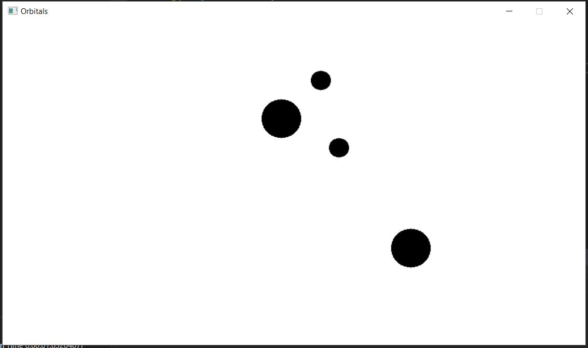

#Sprint 1 Review
	Allows the user to launch planets around non-moving blackholes

##New features
+ Gets input from the user and allows them to drag and release to launch planets
+ Blackholes do not move, allowing the user to make their planets orbit around them
+ 

##Features failed to add
+ Not many unit tests could be implemented since most functions were dependaant on swingame

##Suggestions for the next Sprint
+ Lines to predict and draw the path of planets
+ Colours for different planets
+ Border limits for objects