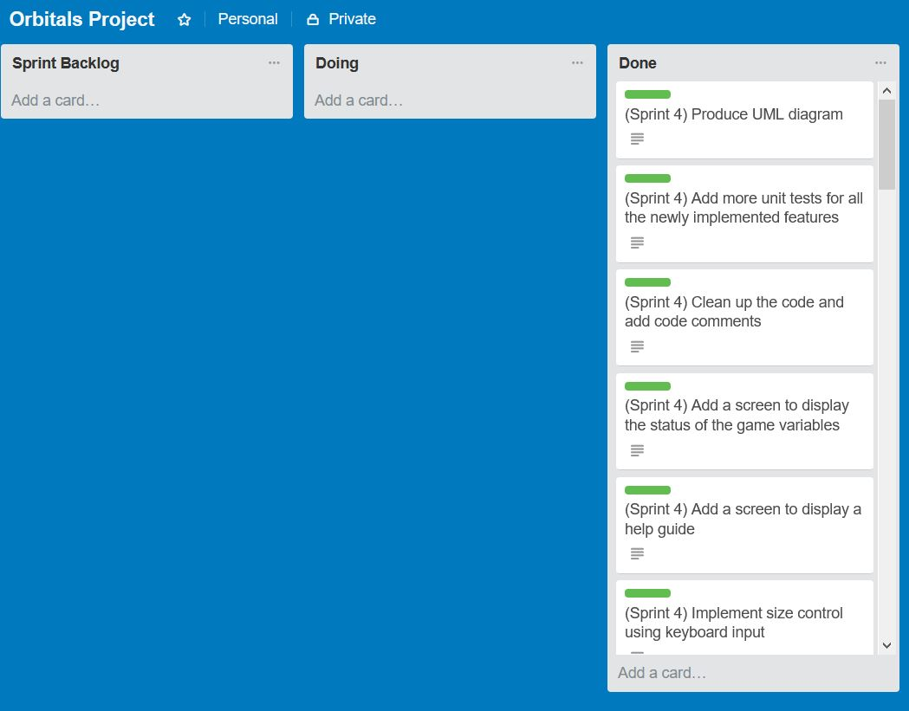

##What worked well
+ Toggl - really helpful with managing and tracking time. Reports could be generated for insights
+ VS - using inbuilt vs tool to get tasks done faster (such as intergrated git control, UMl generation etc.)
+ ReSharper - good use of R#, including code completion and code cleanup tools
+ Git branching - feature branches were used for major changes

##What could be improved
* Time estimates for tasks were less less accurate than the last sprint
	* Overestimation - being more familarised with the code after 3 sprints made me more faster at getting tasks done
	* Some tasks were ambiguous since it was the final sprint before the release

##Trello Screenshot

##Toggl Report
+ A Toogl time report PDF can be found in this folder