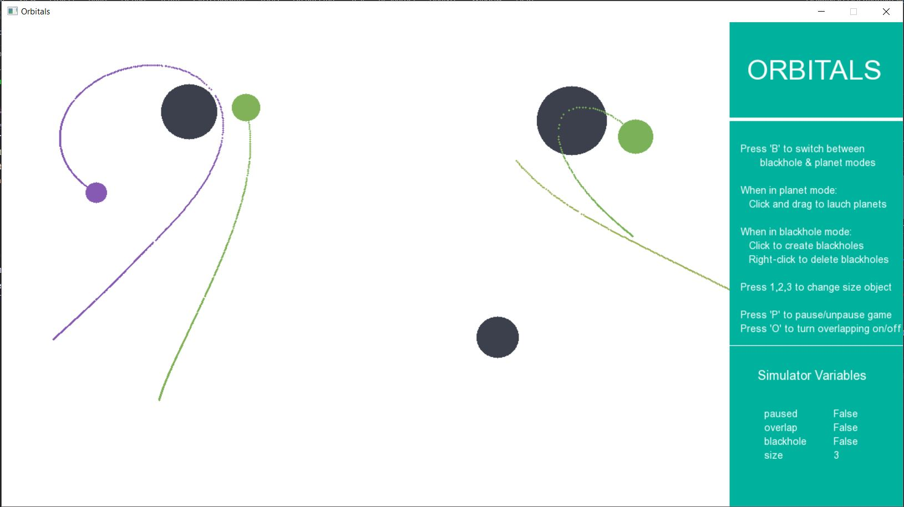

#Sprint 1 Review
	More control and information was made available to the user, and the project was finalised for release.

##New features
+ User an toggle pause and overlap using keyboard
+ User can create/delete blackholes
+ User can control the size of the oobjects they create
+ Panel showing help tips and game variables implemented
+ More code documentation added
+ More unit tests added
+ UML diagram added to the README
+ 

##Features failed to add
+ N/A

##Suggestions for the next Sprint
+ N/A